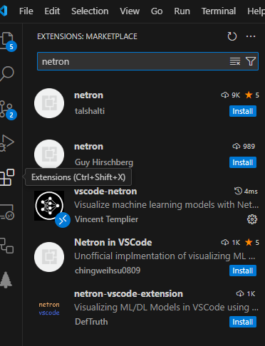
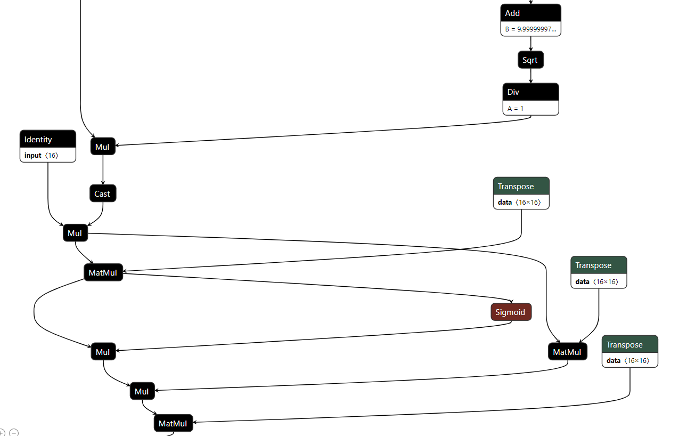

.. _l-feuille-de-route-2024-3A:

2024-05-31: Feuille de route 2023-2024 (3A)
===========================================

* Main Web Site : `https://sdpython.github.io/ <https://sdpython.github.io/>`_
* Material : `https://sdpython.github.io/doc/teachcompute/dev/ <https://sdpython.github.io/doc/teachcompute/dev/>`_

Plan
++++

Les cours et séances se déroulent sur 6 séances de 3h au second semeste.

Intervenants
++++++++++++

Xavier Dupré, Matthieu Durut.

Evaluation
++++++++++

Optimize a machine learning model by fusing operations.

* `alpindale/Llama-2-7b-ONNX <https://huggingface.co/alpindale/Llama-2-7b-ONNX>`_

::

    pip install -U huggingface_hub
    huggingface-cli download alpindale/Llama-2-7b-ONNX --repo-type model --cache-dir cache --local-dir . --local-dir-use-symlinks False

Or:

::

    python -m experimental_experiment.torch_bench.export_model --model llama --mixed 1 --exporter script --config small --num_hidden_layer 2

One part of the llama model:

The goal is not to optimize the whole model
but to optimize locally one execution path,
in CUDA or CPU.
To get that model: :ref:`l-example-vizualize-llama-model`.

Notes
+++++

Liens, notebooks prévus pour les séances pratiques.

Séance Pratique 1 - 10/04
^^^^^^^^^^^^^^^^^^^^^^^^^

Séance pratique sur CPU.

1. Environnement

* Setup SSP Cloud, présentation d'un package, C++
* Outils de développement : :epkg:`cmake`, :epkg:`git`, :epkg:`pull request`
* Python : :epkg:`setup.py`, :epkg:`sphinx`, :epkg:`pybind11`, :epkg:`cython`
* style : :epkg:`black`, :epkg:`ruff`
* :epkg:`github` et intégration continue
* Copy/Pasting is your friend.

2. Examples

* :ref:`l-parallelization-vector-sum`
* :ref:`l-parallelization-dot-product`
* :ref:`l-compare-filtering-implementation`
* :ref:`l-parallelization-processes`

3. Concepts

* parallelization, conflicts
* thread / process
* :epkg:`AVX`
* branching, cache L1, L2, L3
* C++ syntax

4. Technics

* :epkg:`C++`
* :epkg:`Python C API`
* :epkg:`pybind11`, :epkg:`cython`
* :epkg:`blas`, :epkg:`lapack`, :epkg:`Eigen`, :epkg:`blis`

**Instructions pour démarrer**

* Aller sur la plate-forme `SSPCloud de l'ENSAE <https://datalab.sspcloud.fr/home>`_.
* Se connecter avec son adresse ENSAE
* Ouvrir une instance :epkg:`vscode-python`

Il ensuite exécuter les instuctions suivantes en ligne de commande.

:: 

    git clone https://github.com/sdpython/teachcompute.git
    cd teachcompute
    python setup.py build_ext --inplace

Si ça ne marche, installer cmake: ``conda install cmake``.
Puis :

::

    export PYTHONPATH=<this folder>
    python _doc/examples/plot_bench_cpu_vector_sum.py

Séance Pratique 2 - 17/04
^^^^^^^^^^^^^^^^^^^^^^^^^

CUDA

Les séances pratiques s'appuient sur le package :epkg:`teachcompute`.

::

    git clone https://github.com/sdpython/teachcompute.git
    cd teachcompute
    python setup.py build_ext --inplace

1.

* CUDA, threads, blocks, parallélisation
* gestion de la mémoire, CPU, CUDA

2. addition de deux vecteurs

* :ref:`l-example-cuda-vector-addition`
* `cuda_example.cu L19 <https://github.com/sdpython/teachcompute/blob/main/teachcompute/validation/cuda/cuda_example.cu#L19>`_
* code C++, template, macro
* gcc, nvcc
* extension .c, extension .cu
* ``__device__``, ``__globals__``, ``__inline__``, `<<< >>>`
* profiling with ``nsys profile python <script.py>``

2. somme d'un vecteur

* :ref:`l-example-cuda-vector-sum`
* `cuda_example.cu L61 <https://github.com/sdpython/teachcompute/blob/main/teachcompute/validation/cuda/cuda_example.cu#L61>`_
* `cuda_example_reduce.cu <https://github.com/sdpython/teachcompute/blob/main/teachcompute/validation/cuda/cuda_example_reduce.cu>`_
* somme des éléments d'un vecteur, réduction
* synthreads
* mémoire partagée, notion de cache

3. ScatterND

* :ref:`l-example-cuda-vector-addition-stream`
* `cuda_example.cu <https://github.com/sdpython/teachcompute/blob/main/teachcompute/validation/cuda/cuda_example.cu>`_
* notion de Stream

4. extension torch

* :epkg:`pytorch`
* `torch_extensions <https://github.com/sdpython/teachcompute/blob/main/teachcompute/torch_extensions>`_

5.

* :epkg:`DLPack`
* device
* A100, H100
* float32, float16, float8
* multiple nvidia on the same machine

Séance Pratique 3 - 03/05
^^^^^^^^^^^^^^^^^^^^^^^^^

Partie I : ML

* :epkg:`Triton`, :epkg:`TVM`, :epkg:`AITemplate`,
* notion de déploiement de modèle de machine learning,
  :epkg:`docker`, :epkg:`ONNX`, autres..., que veut dire
  optimiser son code pour l'apprentissage puis déployer
  ensuite sur une autre machine.

Partie II : cas concret

Comment paralléliser...

* Un tri ?
* Le calcul de la médiane ? (:epkg:`BJKST`) Propriétés statistiques ?
* Pourquoi est-ce si difficile de paralléliser un tri ?
* `scatter_nd <https://www.tensorflow.org/api_docs/python/tf/scatter_nd>`_,
  Que faire quand les indices sont dupliqués ?
* Paralléliser une forêt aléatoire sur CPU, sur GPU ?
* La recherche de doublons dans une liste de
  coordonnées géographiques (longitude, latitude) ?
* `An Efficient Matrix Transpose in CUDA C/C++
  <https://developer.nvidia.com/blog/efficient-matrix-transpose-cuda-cc/>`_,
  notion de Bank Conflicts (voir 
  `CUDA C++ Programming Guide <https://docs.nvidia.com/cuda/cuda-c-programming-guide/index.html>`_)
  `CUDA, Cartes graphiques, Warp... <https://leria-info.univ-angers.fr/~jeanmichel.richer/cuda_crs4.php>`_

Partie III : modifier un package

Copier/coller, recherche, quelques astuces pour insérer son code dans un package.

Séance Théorique 1 - 12/04
^^^^^^^^^^^^^^^^^^^^^^^^^^

1.

* hardware
* ordinateur
* mémoire partagée
* ordre de grandeur vitesse CPU, communication
* caches

2.

* algorithmes répartis
* multithread
* `race condition <https://en.wikipedia.org/wiki/Race_condition>`_
* verrou

